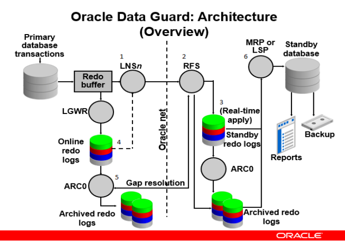
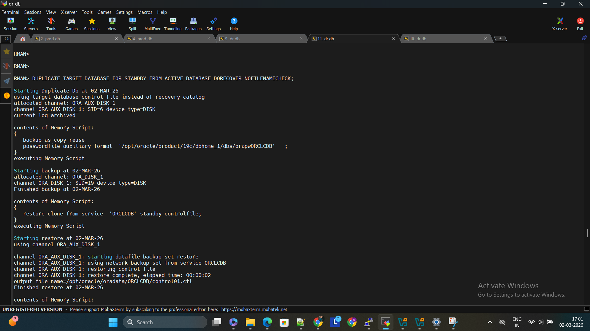
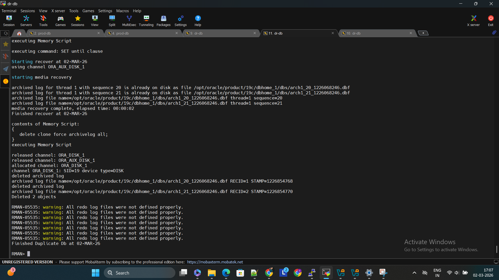
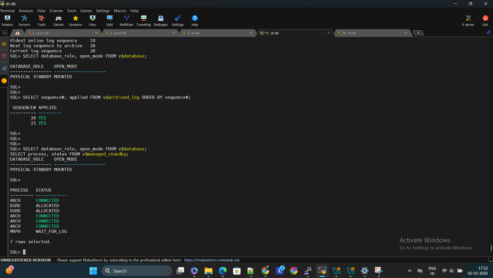

# Oracle 19c Data Guard Physical Standby Setup

This project demonstrates the configuration of **Oracle Data Guard Physical Standby Database** using **RMAN Active Database Duplication**.

The standby database continuously receives and applies redo logs from the primary database for **Disaster Recovery (DR)**.

---

# Architecture

Primary Server : prod-db  
Standby Server : dr-db  

Oracle Version : 19c  
OS : Linux  



Primary Database  ---> Redo Transport ---> Standby Database

---

# Step 1 : Verify Archivelog Mode on Primary

```sql
archive log list;
```

Enable if not enabled

```sql
shutdown immediate;
startup mount;
alter database archivelog;
alter database open;
```

---

# Step 2 : Enable Force Logging

```sql
ALTER DATABASE FORCE LOGGING;
```

Verify

```sql
SELECT force_logging FROM v$database;
```

---

# Step 3 : Configure TNS Connectivity

Check connectivity between primary and standby

```bash
tnsping ORCLCDB
tnsping ORCLCDB_STBY
```

---

# Step 4 : Create Standby Database Using RMAN Active Duplicate

Connect to RMAN

```bash
rman target sys@ORCLCDB auxiliary sys@ORCLCDB_STBY
```

Run duplicate command

```rman
DUPLICATE TARGET DATABASE
FOR STANDBY
FROM ACTIVE DATABASE
DORECOVER
NOFILENAMECHECK;
```

Screenshot



---

# Step 5 : Duplicate Completed Successfully



---

# Step 6 : Verify Standby Database Role

Login to standby database

```bash
sqlplus / as sysdba
```

Run

```sql
SELECT database_role, open_mode
FROM v$database;
```

Expected Output

```
DATABASE_ROLE     OPEN_MODE
---------------------------
PHYSICAL STANDBY  MOUNTED
```

Screenshot



---

# Step 7 : Start Managed Recovery Process (MRP)

```sql
ALTER DATABASE RECOVER MANAGED STANDBY DATABASE DISCONNECT FROM SESSION;
```

---

# Step 8 : Verify MRP Process

```sql
SELECT process, status FROM v$managed_standby;
```

Expected Output

```
PROCESS STATUS
--------------
MRP0   WAIT_FOR_LOG
```

Screenshot


---

# Step 9 : Verify Archive Log Apply

```sql
SELECT sequence#, applied
FROM v$archived_log
ORDER BY sequence#;
```

Expected Output

```
SEQUENCE# APPLIED
20        YES
21        YES
```

This confirms **redo logs are successfully applied on standby database**.

---

# Result

Successfully configured **Oracle Data Guard Physical Standby Database** with:

- RMAN Active Duplication
- Redo Log Shipping
- Managed Recovery Process
- Archive Log Apply

This setup provides **Disaster Recovery capability** for the primary database.

---

